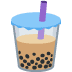
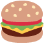
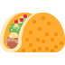
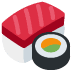

# PayNow QR skill


Local Singapore PayNow QR generator for Grok, Claude, and other agents. No API key.

This repository *is* the skill. `SKILL.md` is at the repo root.

Repo: https://github.com/itchimi2p2qa/paynow-qr-skill

## Point an AI at this repo

Paste one of these to Grok, Claude Code, Codex, or Cursor:

```
Install the PayNow QR skill from https://github.com/itchimi2p2qa/paynow-qr-skill
```

```
npx skills add itchimi2p2qa/paynow-qr-skill
```

```
git clone https://github.com/itchimi2p2qa/paynow-qr-skill.git ~/.claude/skills/paynow-qr
```

Then, once, set the installer's own mobile:

```
python3 scripts/setup_payee.py --mobile +65XXXXXXXX
pip install segno pillow
```

Claude.ai website skills are account settings. A chat cannot write them. There you still do:
Settings → Capabilities → Skills → Upload skill →
https://github.com/itchimi2p2qa/paynow-qr-skill/archive/refs/heads/main.zip

A folder named `paynow-qr-skill-main` is fine if `SKILL.md` is inside it.

## What it does

- Builds the EMVCo / SGQR payload on the machine
- CRC-16/CCITT-FALSE (`123456789` → `29B1`)
- Mobile, UEN, open amount, bill reference, favorites
- Optional center sticker from `assets/icons/`
- Confirms encoded details before showing the image

PayNow transfers are effectively irreversible. The receiving bank shows the registered account name on scan.

## Center stickers

73 bundled Twemoji icons. Say the name in chat (`put a burger on it`) or pass `--icon burger`.

Default is no sticker (`none` or `paynow`) so the QR stays easiest to scan. If a bank app struggles with a sticker, regenerate without one.

### Drinking

 `beer`
 `cheers`
 `wine`
 `cocktail`
 `tropical`
 `champagne`
 `whisky`
 `sake`
 `boba`
 `coffee`
 `tea`

### Food

 `pizza`
 `burger`
 `fries`
 `taco`
 `sushi`
 `ramen`
 `hotpot`
 `chickenwing`
 `steak`
 `curry`
 `icecream`
 `donut`
 `cake`
 `chocolate`
 `banana`

### Travel

 `plane`
 `island`
 `beach`
 `luggage`
 `taxi`
 `train`
 `ship`
 `hotel`
 `map`
 `ticket`
 `mountain`
 `sunset`

### Dance

 `dancer`
 `groove`
 `ballet`
 `disco`
 `party`
 `confetti`

### Entertainment

 `clapper`
 `popcorn`
 `mic`
 `headphones`
 `notes`
 `game`
 `joystick`
 `slots`
 `masks`
 `magic`
 `circus`
 `darts`

### Memes

 `joy`
 `moai`
 `skull`
 `clown`
 `frog`
 `duck`
 `chicken`
 `cat`
 `dog`
 `cool`
 `nerd`
 `alien`
 `fire`
 `poop`
 `goat`
 `melt`
 `peek`

Twemoji stickers are CC-BY 4.0 Twitter, Inc.

## License

MIT
